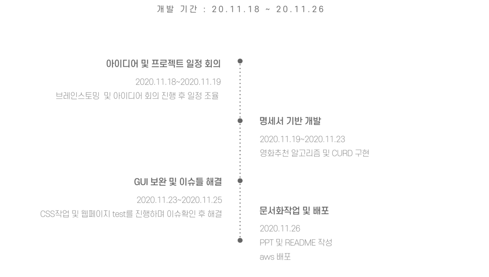
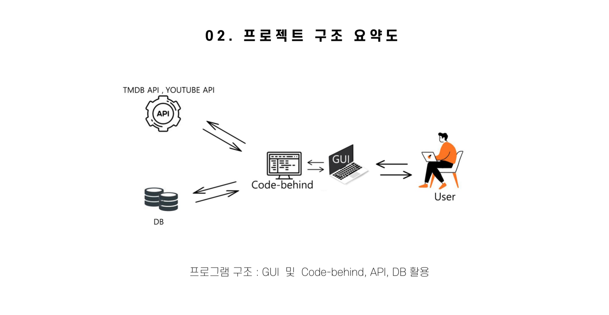
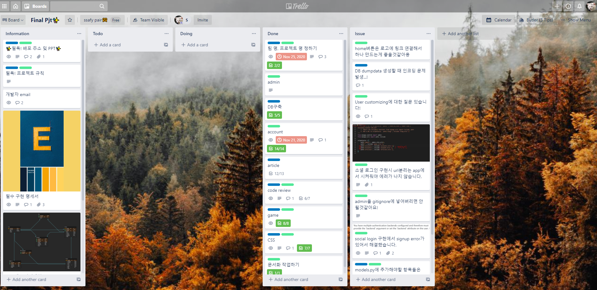

# RETRO MOVIE RANDOM GAME 

삼성 청년소프트웨어 아카데미 (이하 SSAFY)에서 진행했던 마지막 프로젝트(Final project) 입니다.

페어로 진행되어 팀은 저를 포함한 2명으로 구성돼었고 풀스택 개발로 진행되었습니다.

## 개발일정

# 어플리케이션 한 줄 소개 

선택지가 너무 많아도 문제입니다. 

세상 무엇보다 결정이 힘든 사람들을 위해 '아무거나'라는 선택지 대신 '랜덤'이라는 선택지를 제시하여 보다 재미있는 영화를 쉽고 간편하게 선택 할 수 있게 했습니다.

90년대 생들이라면 한 번쯤 해봤을 `ESC랜덤게임`에서 아이디어를 착안해 프로그램을 개발하게 되었습니다. 

# 프로젝트 설정 및 실행방법

### 프로젝트 구조요약도

### 홈페이지  

홈페이지에 들어가서 로그인과 회원가입일 진행한 후 랜덤으로 선택해 뽑아주는 게임을 실행 합니다.

### 로그인 

소셜로그인 기능 구현으로 구글아디나 네이버 아이디로 로그인이 가능합니다. 

### 실행 장면 

# 주요 기능

인기있는 500개의 영화를 바탕으로 랜덤으로 사용자가 버튼을 클릭하면 해당 영화를 추천해주는 영화추천 알고리즘이 주요 기능입니다. 

선택은 오로지 사용자의 손가락에 의해 결정 됩니다. 

또한 예고편을 보고 난 후 찜한 목록만 영화 후기를 작성할 수 있어 예고편이 얼마나 본편으로 구매 욕구를 이글어 내는지 효과를 볼 수 있습니다.

영화에 대한 평가와 사용자들끼리 소통할 수 있는 커뮤니티 페이지도 주요 기능 중 하나입니다. 

## PART 소개

# 문제점과 해결방법

# 느낀점

웹 크롤링 부터 JS코드로 Random Game을 구현해 나가기 까지 막막하면서도 시간이 많이 부족하다고 느끼는 순간들이 많았습니다.

하지만 페어의 약점이 내 강점이 되고 내 약점이 페어의 강점이었을 때, 엄청난 파급력이 있다는 걸 깨달았습니다. 

서로가 서로에게 멘토,멘티가 되면서 일주일 동안 새로운 기술을 도입하고 우리가 생각했던 아이디어를 구현해 나갈 수 있었습니다. 

같이 했던 페어가 없었다면 시간안에 구현하지 못했을 겁니다.🙂

이번 프로젝트를 통해 '같이의 가치'를 명확하게 느꼈던 것 같습니다.

또한 Trello에 서로의 상황을 적고 소통하는 방식이 잘 맞았던 덕분에 큰 문제 없이 프로젝트가 잘 진행 될 수 있었습니다. 

다양한 협업툴이 존재하지만 사용하지 않으면 큰 강점으로 발휘되지 못하는 것 같습니다. 

하지만 이번 페어프로젝트에선 다양한 협업툴이 그 어느때보다 언택트로 진행된 프로젝트에서 빛을 발휘했습니다. 

다시 한 번 소통의 필요성이 크다고 느꼈던 프로젝트였습니다.

